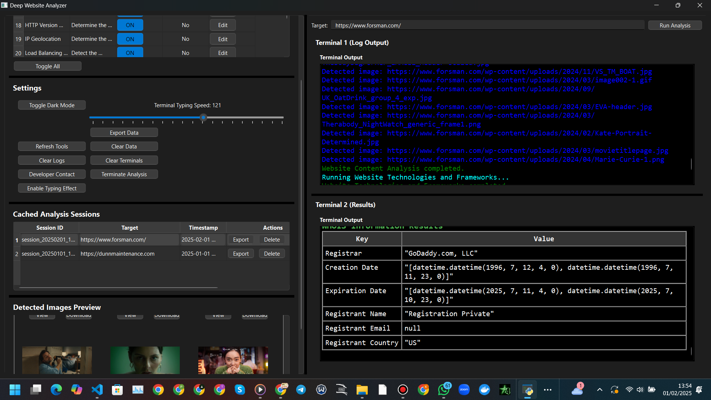

Deep Website Analyzer
=====================

Version: 1.0.0

 [](https://github.com/thehackitect/deep-website-analyzer)[](https://github.com/thehackitect/deep-website-analyzer)

[Overview](#overview) [Features](#features) [Installation](#installation) [Usage](#usage) [Project Structure](#project-structure) [Contributing](#contributing) [License](#license)

Overview
--------

**Deep Website Analyzer** is a powerful desktop application built with Python and PyQt6. It enables users to perform an in-depth analysis of websites by leveraging a modular plugin-based architecture. Whether you're checking accessibility, SEO, security, or performance, this tool provides a comprehensive solution for all your web analytics needs.

[](demo.mp4)


Features
--------

*   **Plugin-Based Architecture:** Extend functionality easily by adding plugins to the `plugins/` folder.
*   **User-Friendly Interface:** A visually appealing and intuitive GUI built with PyQt6 for effortless navigation.
*   **Real-Time Terminals:** Dual terminal panels that display logs and analysis results in real-time with customizable typing effects.
*   **Session Caching:** Automatically save analysis sessions to the `cache/` folder for later review.
*   **Data Export Options:** Export results in JSON, HTML, or PDF formats with customizable themes and colors.
*   **Image Gallery:** Detect, download, and preview images extracted from analysis results.
*   **Customization Options:** Enable dark mode, adjust typing speeds, and configure API keys for various plugins.

Installation
------------

1.  **Clone the Repository:**
    
    git clone https://github.com/thehackitect/deep-website-analyzer.git
    cd deep-website-analyzer
    
2.  **Create and Activate a Virtual Environment:**
    
    python -m venv venv
    # On Unix or macOS:
    source venv/bin/activate
    # On Windows:
    venv\\Scripts\\activate
    
3.  **Install Dependencies:**
    
    pip install -r requirements.txt
    

Usage
-----

Launch the application by running the following command in your terminal:

python main.py

Once started, you can select tools, adjust settings, and run detailed analyses on your chosen URL, IP, or domain. The application displays real-time logs and results in two separate terminal panels for a seamless user experience.

Project Structure
-----------------
```
├── app.log
├── cache/
├── logs/
├── main.py
├── plugins/
│   ├── accessibility\_user\_experience.py
│   ├── api\_endpoints\_documentation.py
│   ├── backup\_old\_files\_detection.py
│   ├── banner\_grabbing.py
│   ├── base\_plugin.py
│   ├── captcha\_form\_anti\_automation.py
│   ├── cdn\_hosting\_provider.py
│   ├── content\_language\_analysis.py
│   ├── cookies\_session\_data\_analysis.py
│   ├── cookie\_policy\_gdpr\_compliance.py
│   ├── database\_error\_detection.py
│   ├── dns\_records.py
│   ├── email\_addresses\_extraction.py
│   ├── email\_authentication\_records.py
│   ├── exif\_metadata\_extraction.py
│   ├── file\_upload\_functionality\_testing.py
│   ├── historical\_data\_archive.py
│   ├── http\_headers.py
│   ├── http\_version\_protocol\_support.py
│   ├── ip\_geolocation.py
│   ├── load\_balancing\_and\_infrastructure\_detection.py
│   ├── reverse\_ip\_lookup.py
│   ├── search\_engine\_indexing.py
│   ├── security analysis.py
│   ├── site\_traffic\_data.py
│   ├── social\_media\_third\_party.py
│   ├── ssl\_certificates.py
│   ├── subdomain\_enumaeration.py
│   ├── uptime\_performance\_metrics.py
│   ├── waf\_detection.py
│   ├── website\_content\_analysis.py
│   ├── website\_technologies.py
│   └── web\_server\_software\_detection.py
├── requirements.txt
├── resources/
│   └── styles/
│       ├── dark.qss
│       └── light.qss
├── test.html
├── test.pdf
├── tests/
│   └── test\_reverse\_ip\_lookup.py
├── tools.json
├── ui/
│   ├── main\_window.py
│   └── terminals.py
└── utils/
    ├── json\_utils.py
    ├── logger.py
    └── plugin\_loader.py
      
```

Contributing
------------

Contributions are highly appreciated! If you have suggestions, new plugin ideas, or bug fixes, please open an issue or submit a pull request on GitHub.

Kindly follow the project's style guidelines and include tests when applicable.

License
-------

This project is licensed under the MIT License. For more details, please see the LICENSE file or the text below:

MIT License

Copyright (c) 2025 Thehackitect

Permission is hereby granted, free of charge, to any person obtaining a copy
of this software and associated documentation files (the "Software"), to deal
in the Software without restriction, including without limitation the rights
to use, copy, modify, merge, publish, distribute, sublicense, and/or sell
copies of the Software, and to permit persons to whom the Software is
furnished to do so, subject to the following conditions:

\[...\]
      

Deep Website Analyzer v1.0.0

Follow us on [GitHub](https://github.com/thehackitect/deep-website-analyzer)